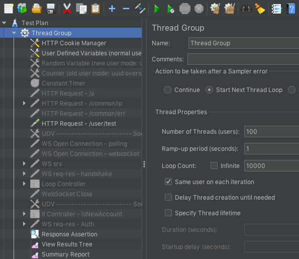

# JServer

JServer is a Node.js server Framework for dealing with HTTP/WebSocket applications

## Features

- ServerType
  - [x] HTTP
  - [x] WebSocket
- Abstraction Layer `DB` | `Cache`
- Asynchronous `DB` writing
- `Cache` LIB support CRUD only in simple Query (supported only MySQL/MariaDB based. other DBMS type Query not yet tested)
- `Cache` TTL can be applied All/Partial
- Supports synchronization the resources between all distributed servers. using by Server to Server broadcasting (e.g. Server Time, Server CDN data, ...)
- Flexibility controllable about time functions (e.g. `times.dailyCode()` by `config.testTime`, see. `src/module/test.timesBoard()`)
- default TimeZone is UTC (log time is UTC fixed), and server's contents time modificable by `times.sync()` on your needs
- Input/Output logging with "(cookie|session|socket)-id, pair-id of each recv-send, pid, IP-address, elapsed-time (ms)" for tracing

  ```text
  ##########################################
  # [2022-04-19T13:09:17.930Z] < UTC fixed #
  ##########################################
  [2022-04-19T13:09:17.930Z][INFO ] [VDlSFz3qYIxYSvhBdXYZsPoEILxWZ4O7][1lvc0khcl265x9m2][recv]{sess: VDlSFz3qYIxYSvhBdXYZsPoEILxWZ4O7, pid: 26544, ip: 1} {"method":"GET","path":"/common/ip","data":{}}
  [2022-04-19T13:09:17.934Z][INFO ] [VDlSFz3qYIxYSvhBdXYZsPoEILxWZ4O7][1lvc0khcl265x9m2][send][3.4140000343322754] {"code":0,"message":"","data":"1"}
  ```

- PacketName customization
- Utilities in `src/schema`
  - dump-structure-\* : current project DB structure dump to `src/schema/${database-name}.sql` (Supports only MySQL/MariaDB yet)
  - init-data-\* : current project Data initialization (Supports only MySQL/MariaDB, Redis yet)

## Requirements

- application
  - Node.js 14.x _or higher_
  - MySQL 5.7.x _or higher_
  - redis 6.x _or higher_
- npm
  - _module-alias_
  - _linq_
  - _uniqid_
  - _socket.io_ : WebSocket
  - _express_ : Http
  - _knex_ : SQL query builder layer (https://knexjs.org)
  - _mysql_ : current project base DBMS npm for knex
  - _redis_ : pubsub for broadcasting, session storage
  - _winston_ : logging
- **register your own host aliases for work flexibility** : `/etc/hosts` OR `C:\Windows\System32\drivers\etc\hosts`
  - 127.0.0.1 appl.host
  - 127.0.0.1 pubsub.host
  - 127.0.0.1 session.host
  - 127.0.0.1 db.host
  - 127.0.0.1 db-slave.host
  - 127.0.0.1 db-master.host
  - 127.0.0.1 cache.host

## Installation

Use the Node package manager [npm](https://github.com/npm/cli) to install.

```bash
$ npm install
```

## Structure

### write only at `>` for scalability & generalization in the future

```
> ├── env
  ├── (auto-generated) log
  ├── (auto-generated) node_modules
  ├── src
  │   ├── common
> │   ├── config
  │   ├── library
  │   │   ├── cache
  │   │   ├── data
  │   │   ├── db
  │   │   ├── router
  │   │   └── server
> │   ├── module
> │   │   └── model
> │   ├── router
  │   └── schema
  └── test
```

## Configuration

1. create Environment name to `env/${env}`

   ```bash
   $ touch env/local
   ```

2. create Configuration set to `src/config/${env}/*.json`

   ```bash
   $ mkdir src/config/local
   $ vi src/config/local/config.json
   $ ...

   # OR copy the existing configurations

   $ cp -R src/config/local src/config/local2
   $ vi src/config/local2/config.json
   $ ...
   ```

3. modify the port / cluster on your needs

   ```
   {
     ...
     "port": {
       ...
       "api": 9100,
       ...
     },
     ...
     "cluster": {
       ...
       "api": true,
       ...
     },
     ...
   }
   ```

4. create the application set

   1. create router. `src/router/${server-name}.js` and write a routes and relations `src/router/index.js`, `src/index.js` of your service

      ```javascript
      const Router = require('@src/library/router');

      class RouterApi extends Router {
        constructor() {
          super();

          Object.assign(this.packetS2C, {
            packetNameA: FunctionA,
            packetNameB: FunctionB,
            ...
          }
        }
      }
      ```

   2. create controller. `src/module/foo.js` (on your needs)
   3. create model. `src/module/model/foo.js` (on your needs)

## Warning: dbWriteAsync

When using the `dbWriteAsync` configuration, `cacheTTL` should be 0. (Cache must be always lives without auto purging by TTL)

Because must be readable on update mode.

```
{
    ...
    "dbWriteAsync": true,
    ...
    "cacheTTL": 0,
    ...
}
```

And for stability, `src/module/model/derived.js` inherits `src/library/data/index.js`

```javascript
// const db = require('@src/library/db');
// const cache = require('@src/library/cache');
const Data = require('@src/library/data');

class Derived extends Data {
  constructor() {
    super();
    // ...
  }

  async test() {
    // await db.execute(params); // write to DB
    // await cache.execute(params); // write to Cache
    await this.execute(params); // write to DB/Cache for auto caching
  }
}

module.exports = Derived;
```

Be aware, on Windows 10 and cluster mode doesn't work properly `before shutdown / SIGINT / ...` functions.

## Notice

Supports transaction by `QuerySet.usetx` option in `src/common/types.js`  
But remind that is performance will be goes down

## Usage

```bash
$ node src/index.js --server-name=${server-name}[ --cluster-cnt=${cnt}]
```

## Examples

### basic

```bash
$ node src/index.js --server-name=api
```

### cluster

```
{
  ...
  "cluster": {
    ...
    "api": true,
    ...
  }
  ...
}
```

```bash
$ node src/index.js --server-name=api                    # cluster count is automatically CPU length - 2
$ node src/index.js --server-name=api --cluster-cnt=2    # cluster count to 2 forcingly
```

## Benchmark (Stress Test, see. `src/module/user.testData()`)

### specifications

```json
{
  "hardware": { "cpu": "AMD Ryzen 5 3600 6-Core Processor 3.60 GHz", "mem": "32 GB", "disk": "HDD" },

  "server": { "version": "ubuntu 20.04 64bit", "cpu": 6, "mem": "16 GB" },
  "server-from": { "Guest": "Oracle VirtualBox", "Host": "Windows 10" },
  "nodejs": { "version": "v14.18.0", "cluster": 4 },
  "mysql": { "version": "14.14 Distrib 5.7.32, for Linux (x86_64)", "LimitNOFILE": 50000, "max_connections": 10000, "max_connect_errors": 10000 },
  "redis": { "version": "6.2.6", "LimitNOFILE": 100000, "save": "", "io-threads": 4, "maxclients": 100000 },
  "jmeter": { "version": "5.4.3", "threads": 100, "count": 10000 },
  "jmeter-plugin": { "name": "WebSocket Samplers by Peter Doornbosch", "file": "jmeter-websocket-samplers-1.2.8.jar" },

  "one cycle": "INSERT * 5, UPDATE * 1, DELETE * 1, SELECT > 4 rows = 4 * 100 * 10000 = 4000000"
}
```

### result-ServerSide-Basic

<!-- &check; -->

| Type                      | Task                                       | pakcet-elapsed-all | pakcet-elapsed-min | pakcet-elapsed-max | err | db-connections | data-created                    |
| :------------------------ | :----------------------------------------- | -----------------: | -----------------: | -----------------: | --: | -------------: | :------------------------------ |
| DB only                   |                                            |                    |                    |                    |     |                |                                 |
|                           | local(debug, non-cluster)-http             |           00:40:14 |            3.48 ms |          629.67 ms |   0 |             17 | { db: 4000000 }                 |
|                           | dev(debug, cluster)-http                   |           00:19:11 |            3.19 ms |          597.98 ms |   0 |            129 | { db: 4000000 }                 |
|                           | live(info, cluster)-http                   |           00:17:15 |            2.56 ms |          405.36 ms |   0 |            222 | { db: 4000000 }                 |
| data (DB with auto Cache) |                                            |                    |                    |                    |     |                |                                 |
|                           | live(info, cluster)-http                   |           00:21:07 |            3.93 ms |          483.51 ms |   0 |            115 | { db: 4000000, cache: 4000000 } |
|                           | live(info, cluster)-dbWriteAsync-http      |           00:07:50 |            1.40 ms |          131.88 ms |   0 |              5 | { db: 4000000, cache: 4000000 } |
|                           | live(info, cluster)-dbWriteAsync-websocket |           00:05:45 |            1.44 ms |          129.90 ms |   0 |              5 | { db: 4000000, cache: 4000000 } |

### result-ServerSide-TPS (Transaction Per Seconds)

| Type                      | Task                                       | tps-count | tps-min | tps-max |  tps-avg |
| :------------------------ | :----------------------------------------- | --------: | ------: | ------: | -------: |
| DB only                   |                                            |           |         |         |          |
|                           | local(debug, non-cluster)-http             |      1470 |      87 |     466 |  413.383 |
|                           | dev(debug, cluster)-http                   |       554 |     543 |     996 |  875.774 |
|                           | live(info, cluster)-http                   |       661 |     643 |    1125 |  972.546 |
| data (DB with auto Cache) |                                            |           |         |         |          |
|                           | live(info, cluster)-http                   |       811 |     514 |     913 |  792.311 |
|                           | live(info, cluster)-dbWriteAsync-http      |       344 |    1092 |    2470 | 2149.863 |
|                           | live(info, cluster)-dbWriteAsync-websocket |       514 |    1027 |    3347 | 2926.927 |

### result-ClientSide-JMeter-Summary-Report

| Type                      | Task                                       | Label                       | # Samples | Average | Min |  Max | Std. Dev. | Error % | Throughput | Received KB/sec | Sent KB/sec | Avg. Bytes |
| :------------------------ | :----------------------------------------- | :-------------------------- | --------: | ------: | --: | ---: | --------: | ------: | ---------: | --------------: | ----------: | ---------: |
| DB only                   |                                            |                             |           |         |     |      |           |         |            |                 |             |            |
|                           | local(debug, non-cluster)-http             | "HTTP Request - /user/test" |   1000000 |     241 |  12 | 1589 |     24.94 |  0.00 % |  414.2/sec |          738.21 |       99.17 |     1825.0 |
|                           | dev(debug, cluster)-http                   | "HTTP Request - /user/test" |   1000000 |     114 |   7 | 1473 |     22.28 |  0.00 % |  869.3/sec |         1549.28 |      208.54 |     1825.0 |
|                           | live(info, cluster)-http                   | "HTTP Request - /user/test" |   1000000 |     103 |   7 | 1402 |     15.53 |  0.00 % |  966.7/sec |         1722.81 |      232.20 |     1825.0 |
| data (DB with auto Cache) |                                            |                             |           |         |     |      |           |         |            |                 |             |            |
|                           | live(info, cluster)-http                   | "HTTP Request - /user/test" |   1000000 |     126 |   8 | 1477 |     18.17 |  0.00 % |  788.9/sec |         1431.47 |      189.11 |    1858.01 |
|                           | live(info, cluster)-dbWriteAsync-http      | "HTTP Request - /user/test" |   1000000 |      46 |   4 | 1396 |     18.64 |  0.00 % | 2129.2/sec |         1653.05 |      510.96 |      795.0 |
|                           | live(info, cluster)-dbWriteAsync-websocket | "WS req-res - userTest"     |   1000000 |      33 |   3 |  541 |     10.43 |  0.00 % | 2903.5/sec |         1559.50 |       73.72 |      550.0 |

## Screenshots

- jmeter-http-100x10000  
  
- jmeter-websocket-100x10000-00  
  
- jmeter-websocket-100x10000-01  
  
- time-function-test  
  
- time-function-real  
  
- socket-client  
  

## Contributing

Pull requests are welcome. For major changes, please open an issue first to discuss what you would like to change.

Please make sure to update tests as appropriate.

## Donation

If this project help you reduce time to develop, you can give me a cup of coffee :)

[](https://www.buymeacoffee.com/windows){:target="\_blank"}

## License

[MIT](https://choosealicense.com/licenses/mit/)
